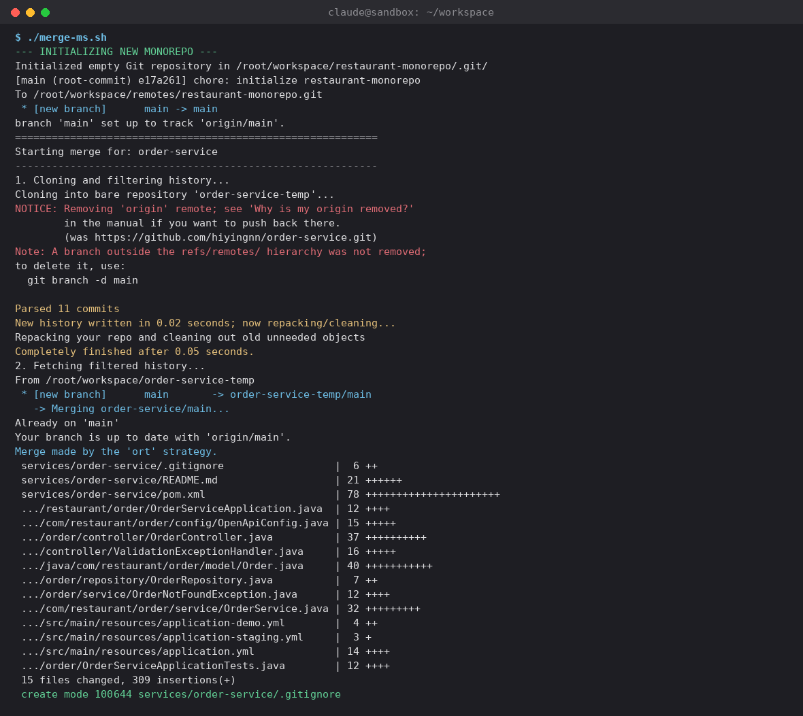
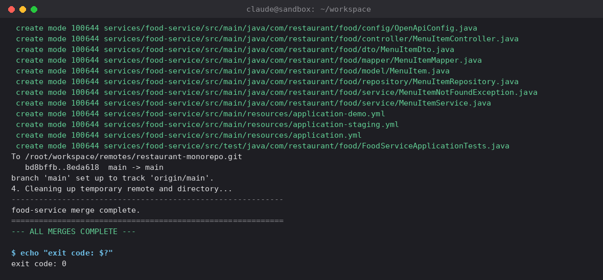
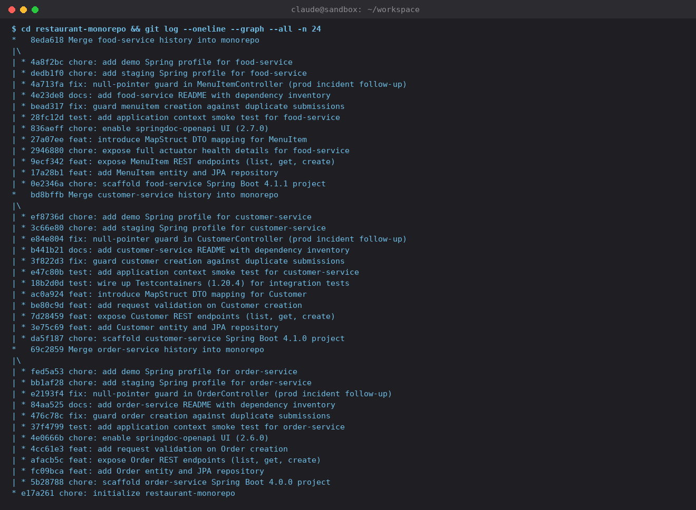

# restaurant-monorepo

This repository is the **after** state of a polyrepo → monorepo migration PoC, built to
accompany the *"From Microservice Sprawl to a Unified Codebase"* Medium article
(Phase B: **Migration to Monorepo using Git, preserve Git history via `git-filter-repo`**).

Three previously independent Spring Boot services — `order-service`, `customer-service`,
and `food-service` — each with their own Git repository and its own trunk-based `main`
branch, were consolidated here into a single Maven multi-module layout **without losing a
single commit, author, or timestamp.**

```
restaurant-monorepo/
├── merge-ms.sh                 # the actual script that built this repo (see below)
├── docs/
│   ├── merge-run.log           # full, unedited stdout/stderr from the run that produced this repo
│   └── screenshots/
│       ├── 01-merge-ms-running.png
│       ├── 02-merge-ms-output.png
│       └── 03-history-preserved.png
└── services/
    ├── order-service/          # formerly its own repo
    ├── customer-service/       # formerly its own repo
    └── food-service/           # formerly its own repo
```

## Before → after

| | Before | After |
|---|---|---|
| Repositories | 3 (`order-service`, `customer-service`, `food-service`) | 1 (`restaurant-monorepo`) |
| Branch model | Trunk-based: one `main` per repo, environment config as Spring profiles | Still trunk-based: one `main` for the whole monorepo |
| Git history | Independent per repo | Fully preserved per service, rewritten under `services/<name>/`, merged with `--allow-unrelated-histories` |
| Build | 3 independent `pom.xml`, no shared governance | Still independent `pom.xml` per module today — this is exactly the drift Phase C (parent POM consolidation) exists to fix |

## Why this is trunk-based, not branch-per-environment

An earlier version of this PoC modeled each service with separate `dev`/`main`/`staging`/
`demo` branches, replayed branch-by-branch into the monorepo. That's a legitimate pattern,
but it adds real merge-topology complexity that has nothing to do with the migration
technique itself. This version keeps one thing constant — **trunk-based development,
single `main` branch** — so the only variable left is the repo count (three vs. one).
Environment-specific configuration (`application-staging.yml`, `application-demo.yml`)
lives as ordinary Spring profiles committed straight to `main`, exactly as it would in a
real trunk-based service.

The practical effect: each service's entire history merges into the monorepo in **one
step** — `git merge <service>/main --allow-unrelated-histories` — instead of four
propagating merges per service. The `--allow-unrelated-histories` flag is still required
for every one of the three merges (each service's history is unrelated both to the
monorepo's own initial commit and to the other services already merged in), but there's
no branch fan-out to reason about on top of that.

## Setup: installing `git-filter-repo`

`merge-ms.sh` depends on [`git-filter-repo`](https://github.com/newren/git-filter-repo),
which is **not** a built-in git command — it's a separate tool (a single Python script
under the hood) that has to be installed before the script will run.

Requirements: Git 2.36.0+ and Python 3.6+.

Pick whichever install path matches your machine:

```bash
# pip (any OS with Python 3 + pip) - what this PoC's environment used
pip install git-filter-repo --break-system-packages   # drop the flag if you're in a venv

# macOS (Homebrew)
brew install git-filter-repo

# Debian/Ubuntu
sudo apt install git-filter-repo

# Windows: install Python 3 first, then
pip install git-filter-repo
```

Verify it's on your `PATH` before running `merge-ms.sh`:

```bash
git filter-repo --version
```

If that prints a version number, `git filter-repo ...` (space, not hyphen) works as a
git subcommand automatically — that's how `merge-ms.sh` invokes it.

## The script: `merge-ms.sh`

Kept at the root of this repo exactly as run. It leans on `git-filter-repo`'s
`--to-subdirectory-filter` to rewrite every past commit of a service so it looks like it
always lived under `services/<name>/`, then fetches that rewritten history into the
monorepo as a temporary remote and merges it into `main` in one step.

The three source URLs now default to the **real, public GitHub repos** this PoC's history
actually lives in:

```bash
ORDER_SERVICE_URL=https://github.com/hiyingnn/order-service.git        # default
CUSTOMER_SERVICE_URL=https://github.com/hiyingnn/customer-service.git  # default
FOOD_SERVICE_URL=https://github.com/hiyingnn/food-service.git          # default
```

`restaurant-monorepo` itself hasn't been pushed to GitHub yet, so `MONOREPO_URL` still
defaults to a local bare repo as the push target. Once you create an empty
`restaurant-monorepo` on GitHub, override it:

```bash
MONOREPO_URL=https://github.com/hiyingnn/restaurant-monorepo.git ./merge-ms.sh
```

Point all four at different remotes (your own fork, GitLab, etc.) the same way — no code
changes needed, just environment variables.

### What actually ran (real output, not staged)

This is a real run against the live GitHub repos above — not the local stand-ins used
while first building this PoC. Notice `(was https://github.com/hiyingnn/order-service.git)`
in the first screenshot: that's git confirming exactly where it cloned from.

**`git-filter-repo` rewriting `order-service`'s history (cloned straight from GitHub) and
its single merge into `main`:**



**The tail end of the run, after all three services were merged into `main`:**



**Proof the history survived the move — real commit hashes, real authors, one clean
merge per service:**



`git-filter-repo` reported **11 commits parsed** for `order-service`, **12** for
`customer-service`, and **12** for `food-service` — matching each polyrepo's real,
linear commit count on `main`. Full unedited output is in `docs/merge-run.log`.

## The dependency drift this sets up (→ Phase C)

The three services were deliberately built with **overlapping but inconsistent**
dependencies — the exact "silent dependency drift" failure mode described in the article —
so that consolidating them under one parent POM (Phase C) has something real to fix:

| Dependency | order-service | customer-service | food-service |
|---|---|---|---|
| Spring Boot | 4.0.0 | 4.1.0 | 4.1.1 |
| Java | 17 | 17 | 21 |
| Lombok | 1.18.30 | 1.18.32 | 1.18.34 |
| spring-boot-starter-validation | ✅ | ✅ | ❌ (missing) |
| MapStruct | ❌ | 1.6.3 | 1.6.3 |
| springdoc-openapi | 2.6.0 | ❌ | 2.7.0 (different version) |
| Testcontainers (test scope) | ❌ | 1.20.4 | ❌ |

Every one of these lines is a small, real inconsistency a team accumulates over time when
each service manages its own `pom.xml` in isolation — three different Spring Boot patch
lines, three different Lombok versions, and two different (non-matching) springdoc
versions. (`order-service`'s Lombok 1.18.30 is old enough to break outright on a modern
JDK — a live compatibility bug, not a hypothetical one — which is its own small
demonstration of what unmanaged version drift costs a team.) None of it is unifiable from
inside this repo yet; that's the point of Phase C.

## Reproducing this from scratch

Once `git-filter-repo` is installed (see Setup, above):

```bash
git clone <this-repo-or-your-fork> restaurant-monorepo-poc
cd restaurant-monorepo-poc
./merge-ms.sh   # rebuilds services/* from the three real GitHub repos, from scratch
```

`services/order-service`, `services/customer-service`, and `services/food-service` are
rebuilt directly from `github.com/hiyingnn/*` each time — this isn't a one-off, it's
re-runnable against whatever those repos currently contain.

## Known limitation of this PoC

This environment could not reach Maven Central, so `mvn package`/`mvn test` were not run
here — the `pom.xml` files are correct, hand-verified Spring Boot 4 configurations, but
compilation against real dependencies hasn't been machine-verified in this sandbox. The
part this PoC actually exists to prove — that `git-filter-repo` + `--allow-unrelated-histories`
merges preserve full, real Git history during a polyrepo → monorepo move — **was executed
for real** and is captured unedited above.
